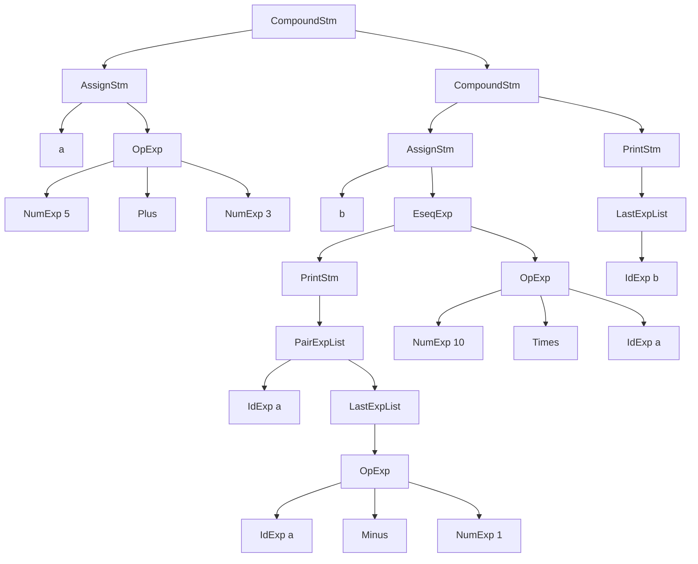

# Compiler Notes

## What is a Compiler?
A compiler is a program that transforms the code you write into **target code** (low-level code such as machine code or assembly code) after moving through multiple phases.

---

## Phases of Compilation

1. **Lexical Analysis (Lex)**  
   Break the source file into individual words, or tokens.

2. **Parsing (Parse)**  
   Analyze the phrase structure of the program.

3. **Semantic Actions**  
   Build a piece of abstract syntax tree (AST) corresponding to each phrase.

4. **Semantic Analysis**  
   Determine what each phrase means, relate uses of variables to their definitions, check types of expressions, and request translation of each phrase.

5. **Frame Layout**  
   Place variables, function parameters, etc. into activation records (stack frames) in a machine-dependent way.

6. **Translation**  
   Produce intermediate representation trees (IR trees), a notation not tied to any particular source language or target machine architecture.

7. **Canonicalization**  
   Hoist side effects out of expressions, and clean up conditional branches for the convenience of the next phases.

8. **Instruction Selection**  
   Group the IR-tree nodes into clumps that correspond to the actions of target-machine instructions.

9. **Control Flow Analysis**  
   Analyze the sequence of instructions into a control flow graph that shows all possible flows of control the program might follow when it executes.

10. **Dataflow Analysis**  
    Gather information about the flow of information through variables of the program.  
    Example: *Liveness analysis* calculates the places where each program variable holds a still-needed value (is live).

11. **Register Allocation**  
    Choose a register to hold each of the variables and temporary values used by the program. Variables not live at the same time can share the same register.

12. **Code Emission**  
    Replace the temporary names in each machine instruction with machine registers.

---

## Notes on Phases
- Each **phase** represents a **module**.  
- An **interface** is the point where modules connect.  

Some compilers:
- Combine **Parse, Semantic Analysis, Translation, and Canonicalization** into one phase.  
- Place **Instruction Selection** later, combining it with **Code Emission**.  
- Simple compilers may omit **Control Flow Analysis, Dataflow Analysis, and Register Allocation** phases.  

---

## Tools
- **Yacc** → converts a grammar into a parsing program.  
- **Lex** → converts a declarative specification into a lexical-analysis program.  

---

## Grammar Example

Stm → Stm ; Stm (CompoundStm)
Stm → id := Exp (AssignStm)
Stm → print ( ExpList ) (PrintStm)
Exp → id (IdExp)
Exp → num (NumExp)
Exp → Exp Binop Exp (OpExp)
Exp → ( Stm , Exp ) (EseqExp)
ExpList → Exp , ExpList (PairExpList)
ExpList → Exp (LastExpList)
Binop → + (Plus)
Binop → − (Minus)
Binop → × (Times)
Binop → / (Div)

## Example Program

the next stm is represend by the following graph for example
a := 5 + 3 ; b := ( print ( a , a - 1 ) , 10 * a ) ; print ( b )

---

## AST Representation (Mermaid)

