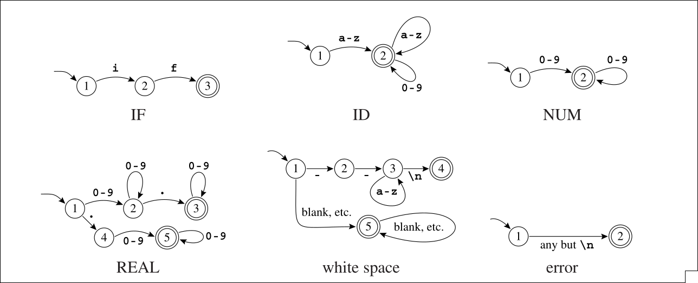

# Lexical Analysis & Regular Expressions

## Lexical Tokens

A programming language classifies lexical tokens into a **finite set of token types**.

### Example Token Types

| Type   | Examples                 |
| ------ | ------------------------ |
| ID     | `foo`, `n14`             |
| NUM    | `73`, `0`, `00`          |
| REAL   | `66.1`, `.5`             |
| IF     | `if`                     |
| COMMA  | `,`                      |
| NOTEQ  | `!=`                     |
| LPAREN | `(`                      |
| RPAREN | `)`                      |
| NUM    | `515`, `082`             |
| REAL   | `10.`, `1e67`, `5.5e-10` |

### Reserved Words

Punctuation tokens such as `IF`, `VOID`, `RETURN` constructed from alphabetic characters are called **reserved words**. In most programming languages, these **cannot** be used as identifiers.

### Nontokens

Examples of nontokens:

* Comments (`/* try again */`)
* Preprocessor directives (`#include<stdio.h>`)
* Macros (`#define NUMS 5 , 6`)
* Blanks, tabs, and newlines

---

## Example: Lexical Analysis of a Program

### Input Program

```c
float match0(char *s) /* find a zero */
{
    if (!strncmp(s, "0.0", 3))
        return 0.;
}
```

### Token Stream

```
FLOAT
LBRACE
ID (match0)
IF
LPAREN
LPAREN
BANG
CHAR
STAR
ID (strncmp)
ID (s)
LPAREN
RPAREN
ID (s)
COMMA
STRING (0.0)
RETURN
REAL (0.0)
COMMA
SEMI
NUM (3)
RBRACE
RPAREN
RPAREN
EOF
```

---

## Language Classification Examples

* **Pascal language**: The set of all strings that constitute legal Pascal programs → **Infinite**
* **Language of primes**: The set of all decimal-digit strings that represent prime numbers → **Infinite**
* **C reserved words**: The set of all alphabetic strings that cannot be used as identifiers in the C programming language → **Finite**

---

## Regular Expressions

### Basic Elements

* **Symbol**: Characters used to construct the language (e.g., `a`, `b`, `0`, `1`).

### Operators

* **Alternation (`|`)**: Choice between expressions.
  Example: `(a|b)` matches `a` or `b`.

* **Concatenation (`.`)**: Expressions appear in sequence.
  Example: `(a|b).a` matches `aa` or `ba`.

* **Epsilon (`ε`)**: Represents the empty string.
  Example: `(a.b)|ε` matches `ab` or empty.

* **Kleene Star (`*`)**: Zero or more repetitions.
  Example: `(a.b)*` matches `""`, `ab`, `abab`, `ababab`, ...

* **Kleene Plus (`+`)**: One or more repetitions.
  Example: `(a.b)+` matches `ab`, `abab`, `ababab`, ...

* **Optional (`?`)**: Zero or one occurrence.
  Example: `a?` matches `""` or `a`.

---

## Token Matching Rules

* **Longest Match**: The longest initial substring of the input that matches any regular expression is taken as the next token.
* **Rule Priority**: If multiple regular expressions match the same substring, the first rule specified determines the token type. The order of rules matters.

---

## Finite Automata Example

Finite automata are used to implement lexical analyzers.

Example diagram:



---

## Additional Notes

* Regular expressions and finite automata are equivalent in expressive power.
* Lexical analyzers are usually implemented in stages:

  1. Convert regular expressions to an **NFA**.
  2. Convert the NFA to a **DFA**.
  3. Minimize the DFA for efficiency.
* Reserved words are handled separately from identifiers to avoid ambiguity.
